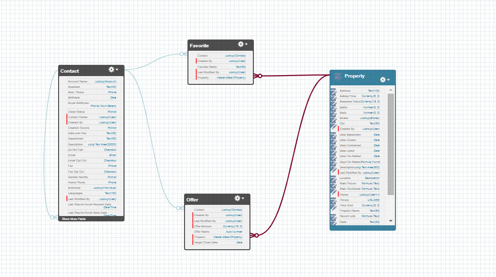
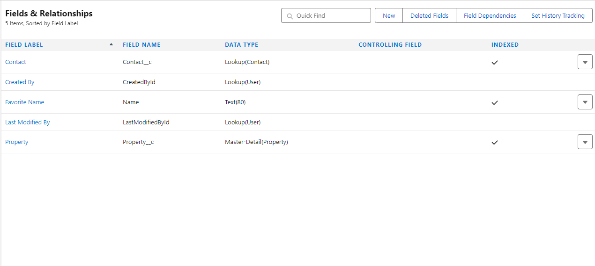
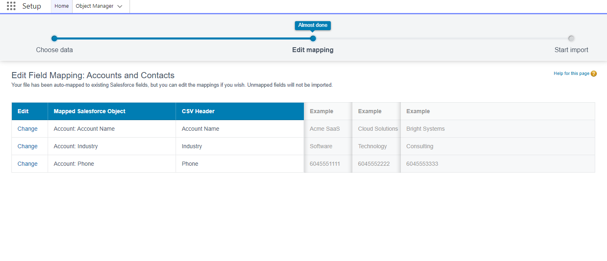
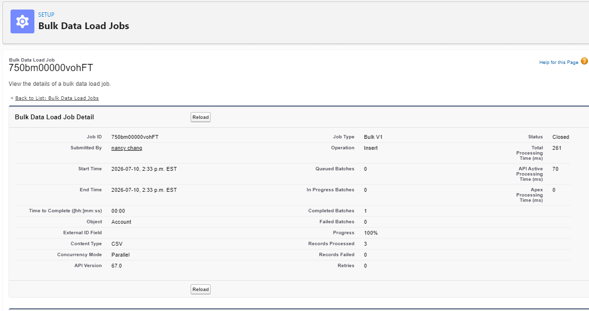

# Salesforce Admin Project - DreamHouse Data Management & Reporting

## Project Overview

This project demonstrates Salesforce Administrator skills including:

- Custom object relationships
- Schema Builder data modeling
- Lookup and Master-Detail relationships
- Data import and field mapping
- Salesforce Reports
- Salesforce Dashboards

The goal of this project was to practice building and managing Salesforce data structures, importing records, and creating reporting solutions.

---

# Salesforce Data Model

## Schema Builder

Created and reviewed object relationships using Salesforce Schema Builder.

Objects included:

- Contact
- Property
- Favorite

Relationships created:

- Favorite → Contact (Lookup Relationship)
- Favorite → Property (Master-Detail Relationship)

Screenshot:

---

# Custom Object Relationships

Created relationship fields using Salesforce Object Manager.

## Lookup Relationship

Favorite records are connected to Contacts who select favorite properties.

## Master-Detail Relationship

Property records act as the master object with Favorite records as related details.

Screenshot:

---

# Data Import

Imported Account data using Salesforce Data Import Wizard.

Steps completed:

- Prepared CSV data
- Mapped CSV fields to Salesforce fields
- Imported Account records
- Verified imported records

## Field Mapping

Screenshot:

## Import Results

Screenshot:

---

# Salesforce Reporting

Created an Account report to analyze customer data.

Report includes:

- Account Name
- Industry
- Phone

Screenshot:

---

# Salesforce Dashboard

Created a dashboard using the Account report.

Dashboard visualization:

- Accounts grouped by Industry
- Donut chart visualization

Screenshot:

---

# Salesforce Admin Skills Demonstrated

✅ Object Modeling  
✅ Schema Builder  
✅ Custom Relationships  
✅ Lookup Relationships  
✅ Master-Detail Relationships  
✅ Data Import Wizard  
✅ Field Mapping  
✅ Reports  
✅ Dashboards  

---

# Tools Used

- Salesforce Lightning Experience
- Salesforce Trailhead
- Data Import Wizard
- Schema Builder
- Reports & Dashboards
